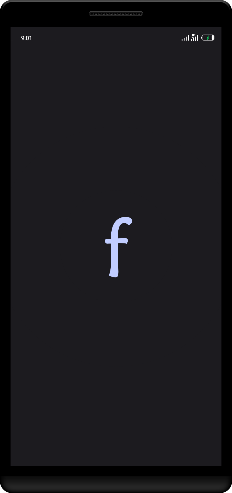
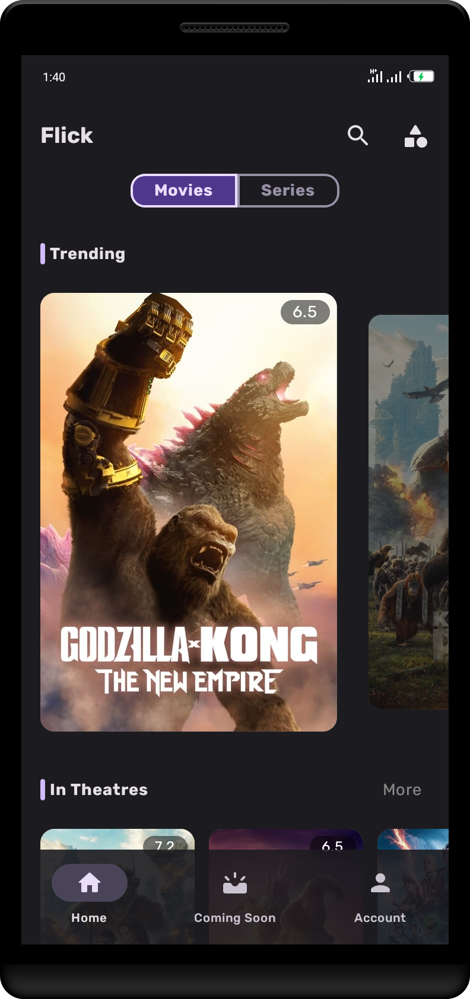
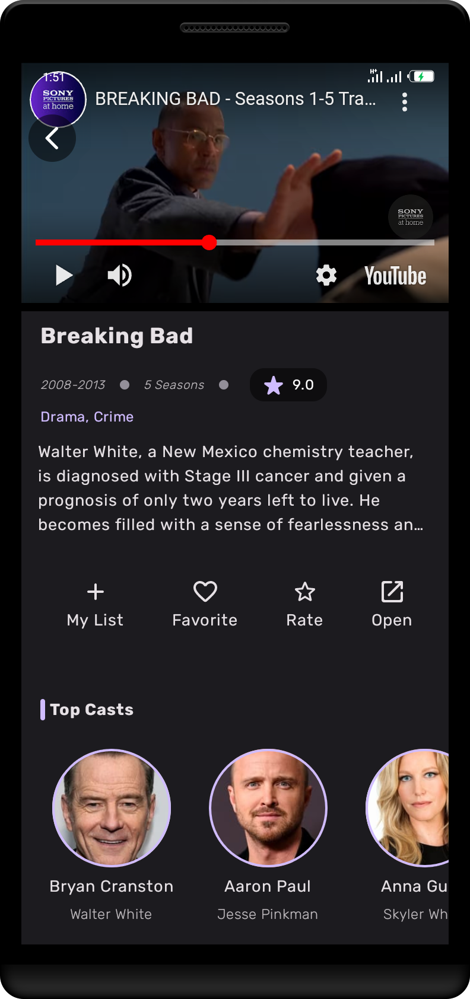

# Flick
Watch trailers and browse info of millions of movies and series.

## Screenshots
|::::::::::::::::::::::::::::::::::::::::|::::::::::::::::::::::::::::::::::::::::|::::::::::::::::::::::::::::::::::::::::|::::::::::::::::::::::::::::::::::::::::|::::::::::::::::::::::::::::::::::::::::|
|:--:|:--:|:--:|:--:|:--:|
||||||

## Features
* Create an account in app or sign-in, for a personalized experience
* Add movies and series to your watchlist
* Favorite your best movies and series
* Rate released movies and series as you like it

## About
* The app uses [The Movie Database (TMDB) API](https://developer.themoviedb.org/docs) to fetch movie data.

* This project was built with Clean Architecture and MVVM pattern.

    There are five _modules_ in this project:

    `app` - The main module serving as the user interface/communication layer

    `data-local` - Stores and fetches stored data from local source using persistence frameworks

    `data-remote` - Fetches data from the internet and manipulates it

    `data-repository` - Responsible for creating and managing data

    `domain` - Houses the entities and use-cases

## Developed with
* [Jetpack Compose](https://developer.android.com/jetpack/compose) - Jetpack Compose is Android’s recommended modern toolkit for building native UI.
* [Coil-kt](https://coil-kt.github.io/coil/compose) - Image loading for Android and Compose Multiplatform.
* [Dagger-Hilt](https://developer.android.com/training/dependency-injection/hilt-android) - Reduces boilerplate of doing manual dependency injection in your project.
* [Material3](https://m3.material.io) - Google's latest design system with adaptable components and tools that support the best practices of user interface design for building beautiful apps.
* [Kotlin Coroutine](https://kotlinlang.org/docs/coroutines-overview.html) - For executing tasks asynchronously.
* [Flow](https://kotlinlang.org/api/kotlinx.coroutines/kotlinx-coroutines-core/kotlinx.coroutine.flow/-flow) - An asynchronous data stream that sequentially emits values and completes normally or with an exception.
* [Stateflow](https://developer.android.com/kotlin/flow/stateflow-and-sharedflow) - An observable state-holder that emits data stream to its collectors - updating the UI incessantly.
* [ViewModel](https://developer.android.com/topic/libraries/architecture/viewmodel) - Stores UI-related data that isn't destroyed on UI changes.
* [Datastore](https://developer.android.com/topic/libraries/architecture/datastore) - Jetpack DataStore is a data storage solution that allows you store key-value pairs asynchronously.
* [Retrofit](https://square.github.io/retrofit) - A type-safe HTTP client for Android and Java.
* [Moshi](https://sqaure.github.io/moshi) - A modern JSON library for Kotlin and Java.
* [OkHttp](https://sqaure.github.io/okhttp) - An efficient HTTP & HTTP/2 client for Android and Java.
* [Paging](https://developer.android.com/topic/libraries/architecture/paging) - Helps load and display pages of data from a larger dataset from local storage or over a network.
* [YouTube Player](https://pierfrancescosoffritti.github.io/android-youtube-player) - YouTube player library for Android and Chromecast.